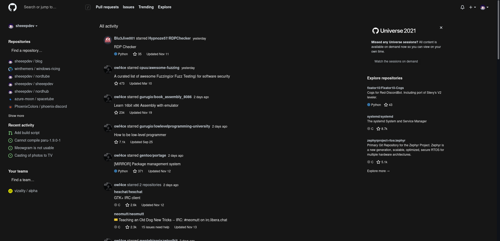

    
    <h2 align="center">Lunar for GitHub</h2>

🌜 A space-inspired theme for GitHub

## 🖼️  Gallery

## ❗ Prerequisites
[Stylus browser extension](https://github.com/openstyles/stylus#releases)

## 💻 Installation

For now dark mode is **required** for the theme to work.

[Click here to install moonhub](https://github.com/lunar-theme/github/raw/main/lunarhub.user.css)

## 🎨 Recommended extensions and styles

🛡️ [Enhanced GitHub](https://github.com/softvar/enhanced-github#supported-browsers) | Enhances GitHub!

🌟 [Refined GitHub](https://github.com/refined-github/refined-github#install) | Refines GitHub

🍴 [Lovely Forks](https://github.com/musically-ut/lovely-forks) | Shows notable forks of GitHub projects

🕴️ [Hide Files](https://github.com/sindresorhus/hide-files-on-github#install) | Hides nonessential files on github

## 🤝 Contributing

Contributions, issues and feature requests are welcome! Feel free to check [issues page](https://github.com/lunar-theme/moonhub/issues). 

## 🌟 Show your support

Give a ⭐️ if you like this project!

## 📝 Note

This is my **personal** theme, there may be some things that you won't like. You'll need to change that by yourself.
Colors are changable by editing the variables in the file.

## 📩 License

Copyright © 2021 [sheepdev](https://sheepdev.xyz/) 
This project is licensed under the [GPL-3.0](https://github.com/lunar-theme/github/blob/main/LICENSE).
